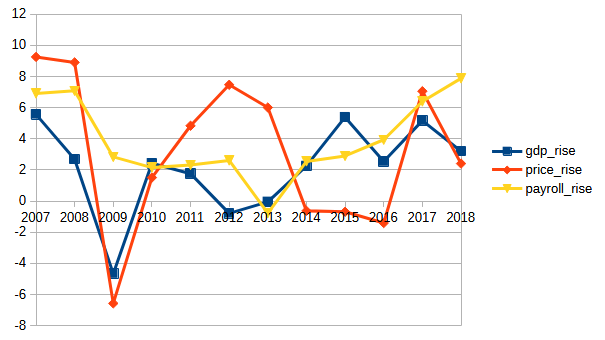

# Dostupnost základních potravin široké veřejnosti

## Závěrečný projekt Datové akademie Engeto

## Zadání

Na vašem analytickém oddělení nezávislé společnosti, která se zabývá životní úrovní občanů, jste se dohodli, že se pokusíte odpovědět na pár definovaných výzkumných otázek, které adresují dostupnost základních potravin široké veřejnosti. Kolegové již vydefinovali základní otázky, na které se pokusí odpovědět a poskytnout tuto informaci tiskovému oddělení. Toto oddělení bude výsledky prezentovat na následující konferenci zaměřené na tuto oblast.

Potřebují k tomu od vás připravit robustní datové podklady, ve kterých bude možné vidět porovnání dostupnosti potravin na základě průměrných příjmů za určité časové období.

Jako dodatečný materiál připravte i tabulku s HDP, GINI koeficientem a populací dalších evropských států ve stejném období, jako primární přehled pro ČR.

## Datové podklady

Datová sada pochází z Portálu otevřených dat ČR.

### [primární tabulka](primary_table.sql)

Obsahuje data o mzdách (mzdy prepočtené na plný úvazek) a data cen potravin - oboje mezi roky 2006-2018.

Vyjímkou je kategorie potravin jakostní víno bílé - ceny nejsou od roku 2006, ale až od roku 2015.

### [sekundární tabulka](secondary_table.sql)

Obsahuje HDP, GINI koeficient a populaci evropských států v období 2006-2018.

## Odpovědi na výzkumné otázky

### 1. Rostou v průběhu let mzdy ve všech odvětvích, nebo v některých klesají?

[datový podklad](q1.sql)

Níže je seznam odvětví v jednotlivých letech, kdy mzdy klesly. Nejčastěji se tak dělo v roce 2013.

|industry_branch                                             |year |salaries |previous_value|percentage_change|
|------------------------------------------------------------|-----|---------|--------------|-----------------|
|Peněžnictví a pojišťovnictví                                |2013|46316.5 |50800.5      |-8.83            |
|Výroba a rozvod elektřiny, plynu, tepla a klimatiz. vzduchu |2013|40761.75|42657.25     |-4.44            |
|Těžba a dobývání                                            |2013|31486.5 |32540.25     |-3.24            |
|Těžba a dobývání                                            |2009|28360.5 |29272.5      |-3.12            |
|Profesní, vědecké a technické činnosti                      |2013|31824.75|32816.75     |-3.02            |
|Veřejná správa a obrana; povinné sociální zabezpečení       |2011|26330.75|26943.5      |-2.27            |
|Stavebnictví                                                |2013|22379.25|22849.75     |-2.06            |
|Činnosti v oblasti nemovitostí                              |2013|22151.5 |22552.5      |-1.78            |
|Vzdělávání                                                  |2010|23023   |23416        |-1.68            |
|Výroba a rozvod elektřiny, plynu, tepla a klimatiz. vzduchu |2015|40452.5 |41093.75     |-1.56            |
|Kulturní, zábavní a rekreační činnosti                      |2013|20510.5 |20808.25     |-1.43            |
|Administrativní a podpůrné činnosti                         |2013|16829.25|17040.5      |-1.24            |
|Ubytování, stravování a pohostinství                        |2009|12333.5 |12471.5      |-1.11            |
|Informační a komunikační činnosti                           |2013|46155   |46641        |-1.04            |
|Velkoobchod a maloobchod; opravy a údržba motorových vozidel|2013|23129.75|23323.75     |-0.83            |
|Zemědělství, lesnictví, rybářství                           |2009|17644.5 |17763.75     |-0.67            |
|Profesní, vědecké a technické činnosti                      |2010|31601.75|31791.25     |-0.6             |
|Těžba a dobývání                                            |2014|31301.75|31486.5      |-0.59            |
|Těžba a dobývání                                            |2016|31626.25|31808.5      |-0.57            |
|Ubytování, stravování a pohostinství                        |2011|13131.25|13205.25     |-0.56            |
|Zásobování vodou; činnosti související s odpady a sanacemi  |2013|23615.75|23717.5      |-0.43            |
|Činnosti v oblasti nemovitostí                              |2009|20706   |20790.25     |-0.41            |
|Veřejná správa a obrana; povinné sociální zabezpečení       |2010|26943.5 |27034.5      |-0.34            |
|Výroba a rozvod elektřiny, plynu, tepla a klimatiz. vzduchu |2011|40201.5 |40295.75     |-0.23            |

### 2. Kolik je možné si koupit litrů mléka a kilogramů chleba za první a poslední srovnatelné období v dostupných datech cen a mezd?

[datový podklad](q2.sql)

Odpověď je v tabulce níže. Množství chleba i mléka které se za mzdu dalo pořídit v čase stouplo.

|name                       |payroll/food|year |food_price|price_value|price_unit|payroll|
|---------------------------|------------|-----|----------|-----------|----------|-------|
|Chléb konzumní kmínový     |1313       |2006|16.12     |1          |kg        |21165 |
|Chléb konzumní kmínový     |1365       |2018|24.24     |1          |kg        |33091 |
|Mléko polotučné pasterované|1466       |2006|14.44     |1          |l         |21165 |
|Mléko polotučné pasterované|1670       |2018|19.82     |1          |l         |33091 |

### 3. Která kategorie potravin zdražuje nejpomaleji (je u ní nejnižší percentuální meziroční nárůst)? 
 
 [datový podklad](q3.sql)

 Nejpomaleji zdražuje cukr a rajská jablka (oboje dokonce se záporným meziročním percentuálním nárůstem), kompletní výsledky níže.

|name                            |avg_percentages_growth|
|--------------------------------|----------------------|
|Cukr krystalový                 |-1.92                 |
|Rajská jablka červená kulatá    |-0.74                 |
|Banány žluté                    |0.81                  |
|Vepřová pečeně s kostí          |0.99                  |
|Přírodní minerální voda uhličitá|1.03                  |
|Šunkový salám                   |1.85                  |
|Jablka konzumní                 |2.01                  |
|Pečivo pšeničné bílé            |2.2                   |
|Hovězí maso zadní bez kosti     |2.53                  |
|Kapr živý                       |2.6                   |
|Jakostní víno bílé              |2.7                   |
|Pivo výčepní, světlé, lahvové   |2.86                  |
|Eidamská cihla                  |2.92                  |
|Mléko polotučné pasterované     |2.98                  |
|Rostlinný roztíratelný tuk      |3.23                  |
|Kuřata kuchaná celá             |3.38                  |
|Pomeranče                       |3.6                   |
|Jogurt bílý netučný             |3.96                  |
|Chléb konzumní kmínový          |3.97                  |
|Konzumní brambory               |4.18                  |
|Rýže loupaná dlouhozrnná        |5                     |
|Pšeničná mouka hladká           |5.24                  |
|Mrkev                           |5.24                  |
|Těstoviny vaječné               |5.27                  |
|Vejce slepičí čerstvá           |5.55                  |
|Máslo                           |6.67                  |
|Papriky                         |7.29                  |

### 4. Existuje rok, ve kterém byl meziroční nárůst cen potravin výrazně vyšší než růst mezd (větší než 10 %)?

[datový podklad](q4.sql)

Nejvyšší kladný rozdíl nárůstu cen oproti růstu mezd je v roce 2013, kdy rozdíl je 6.8 %.

|year |price_rise|payroll_rise|difference|
|-----|----------|------------|----------|
|2013|6.01      |-0.78       |6.79      |
|2012|7.47      |2.61        |4.86      |
|2011|4.84      |2.32        |2.52      |
|2007|9.26      |6.91        |2.35      |
|2008|8.91      |7.08        |1.83      |
|2017|7.06      |6.4         |0.66      |
|2010|1.51      |2.15        |-0.64     |
|2014|-0.63     |2.55        |-3.18     |
|2015|-0.69     |2.9         |-3.59     |
|2016|-1.41     |3.94        |-5.34     |
|2018|2.41      |7.88        |-5.47     |
|2009|-6.57     |2.84        |-9.41     |

### 5. Má výška HDP vliv na změny ve mzdách a cenách potravin? Neboli, pokud HDP vzroste výrazněji v jednom roce, projeví se to na cenách potravin či mzdách ve stejném nebo následujícím roce výraznějším růstem?

[datový podklad](q5.sql)

Ano, výška HDP má vliv na změny ve mzdách a cenách potravin, projevuje se to většinou se zpožděním, viz. obrázek.

